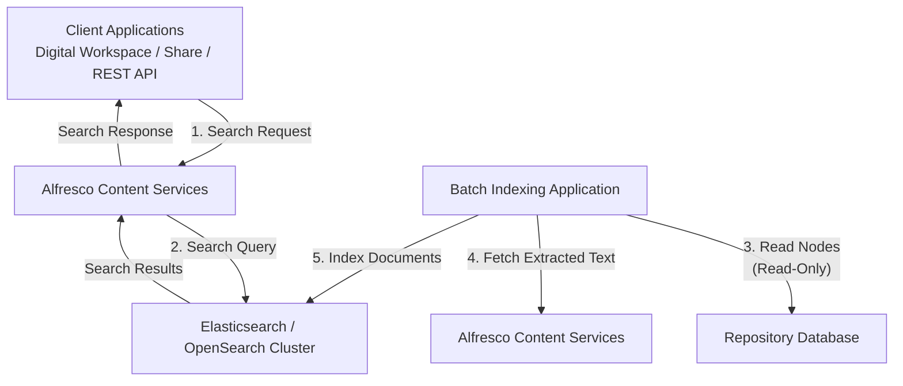

### Project Experience – Document Management and Indexing

In one of my previous projects, I worked on a **Document Content Repository Management System based on Alfresco Content Services**. The platform was responsible for managing and providing access to enterprise documents and associated metadata. The overall architecture consisted of the Content Repository, client applications and user interfaces, Content Services, and a dedicated search and indexing layer.

The following diagram provides a high-level overview of the Content Repository architecture and illustrates how client applications interact with Alfresco Content Services and the underlying search and indexing layer.

**Key technical challenges and contributions:**

* **Large-scale document indexing:**
  Worked on Elasticsearch-based microservices capable of indexing and searching **50+ million records**, with a requirement to maintain sub-second search responses for business-critical document management workflows.

* **Multiple indexing technologies:**
  The existing system used **OpenSearch**, while the new requirement involved Elasticsearch. During the migration, I designed the indexing layer to be **generic and technology-independent**, allowing the application to work with **Solr 6, OpenSearch, or Elasticsearch** based on configuration.

* **`/calculate-folder-size` endpoint:**
  Designed an asynchronous REST API to calculate folder-size information based on the selected indexing technology. The endpoint could trigger the appropriate query implementation for **Solr 6, OpenSearch, or Elasticsearch** without changing the core business logic.

* **Hierarchical folder calculation:**
  One of the challenging parts was that calculating the size of a folder was not limited to the files directly under that folder. The calculation also had to include **all subfolders and the files/content within those subfolders**. This required handling the folder hierarchy correctly while querying and aggregating the indexed document data.

* **Elasticsearch aggregation:**
  Worked with Elasticsearch **aggregation queries** to efficiently calculate folder-level information from a large indexed dataset rather than retrieving and processing all individual records at the application layer.

* **`/get-folder-details` endpoint:**
  Implemented an endpoint to retrieve the calculated folder information, including:

  * **Folder size**
  * **Number of items**
  * **Time taken to generate the folder-size calculation**

* **Asynchronous processing with Kafka:**
  Used **Kafka to decouple the folder-size calculation and retrieval flow**. This helped avoid keeping the API request blocked while processing a potentially large folder hierarchy and allowed the system to handle the calculation asynchronously.

* **Performance improvement:**
  The asynchronous implementation reduced the average API response time by approximately **60% compared with the previous synchronous implementation**.

* **React.js integration:**
  Integrated the API results into **React.js frontend components**, allowing users to view the folder size, item count, and calculation time.

* **Architecture and maintainability:**
  A key design consideration was keeping the **business logic independent of the indexing technology**. The application could select the appropriate indexing implementation through configuration, making it easier to migrate between or support multiple search/indexing platforms without rewriting the core application flow.

**Overall complexity:**

The complexity of this work was not only in implementing two REST endpoints. It involved designing a solution that could work across multiple indexing technologies, handling hierarchical folder structures and large datasets, writing efficient search and aggregation queries, introducing asynchronous communication through Kafka, and maintaining acceptable response times while processing **50+ million indexed records**. This experience significantly strengthened my understanding of distributed processing, search/indexing architecture, abstraction, scalability, and performance optimization.
